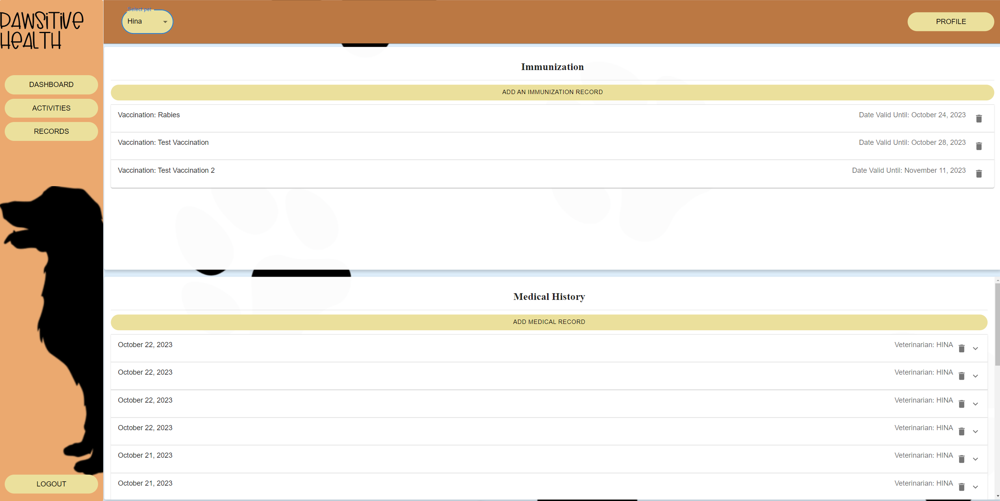

# Graphical Human Interface

---

## Login

On this page, users will be able to log into their existing accounts or create an account using the `Sign Up` link.

---

## Sign Up

On this page, users will be able to create an account using their account by providing:

-   Username
-   First Name
-   Last Name
-   Email
-   Password

---

## Dashboard

On this page, users will be able to view their pet's health and wellness information in a graphical format. Users will be able to view their pet's:

-   Walks
-   Medical Records
-   Sleep Habits
-   Poop Consistency
-   Poop Health

Users are also able to display their other pets' information by selecting the pet from the dropdown menu.

---

## User Profile

On this page, users are greeted with a list of their pets which they can click on to go to their Pet's profile.

---

## Pet Profile

The Pet Profile is accessible when a user clicks on a pet from the User Profile page. On this page, users will be able to view their pet's information, update their pet's information, or even delete their pet from their account in case of an unfortunate event.

## 

## Activities

On this page, users will be able to Add, Modify, and Delete the following activities for their pet:

-   Walks
-   Sleeps
-   Feedings
-   Poops

---

## Records

On this page, users will be able to Add and Delete the following records for their pet:

-   Medical Records
-   Immunization Records

